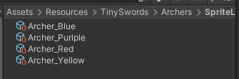
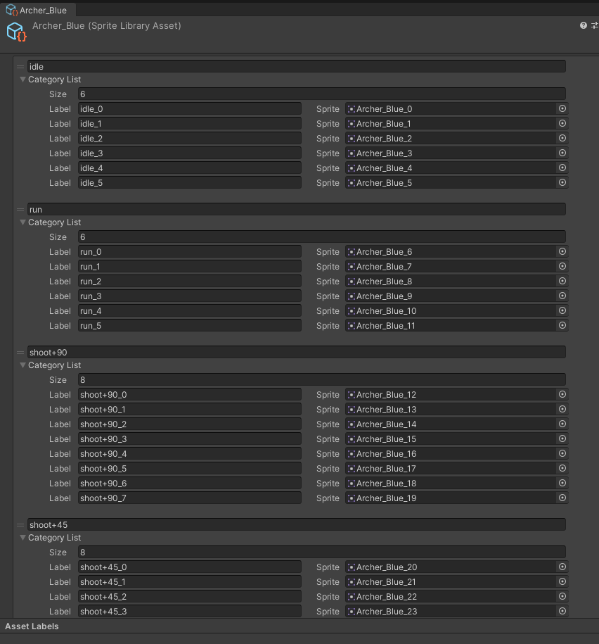
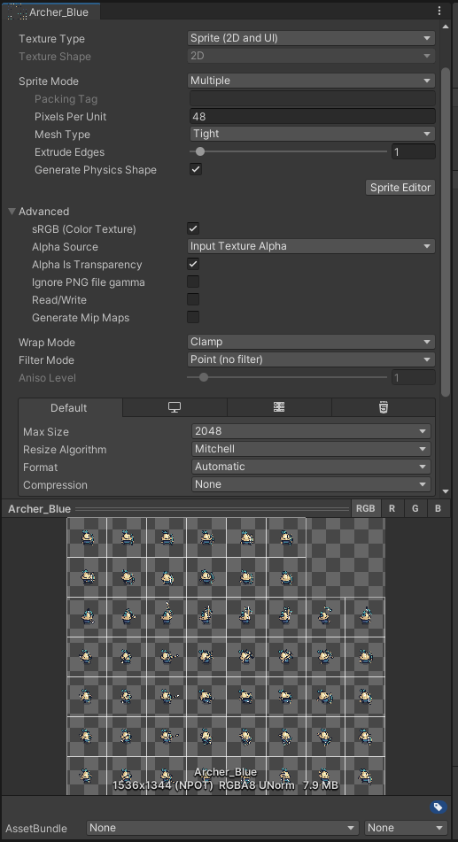
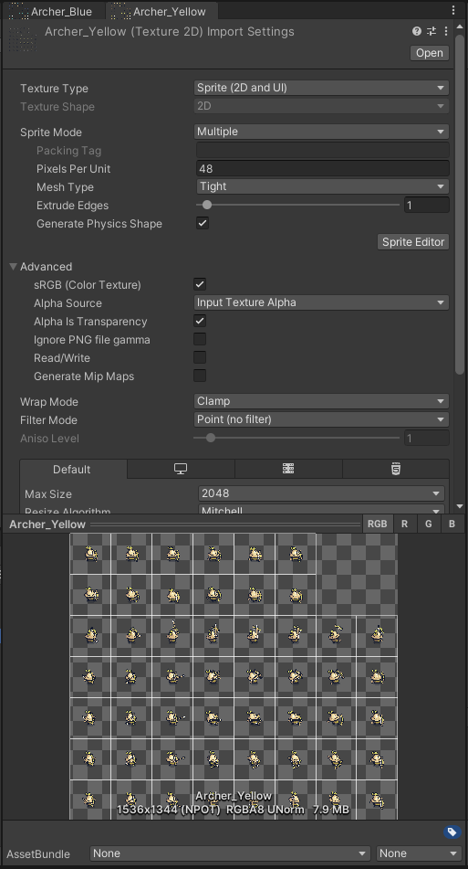
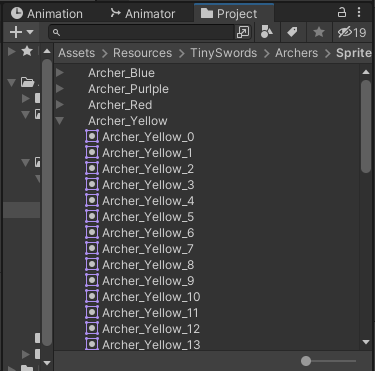
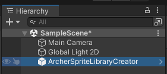
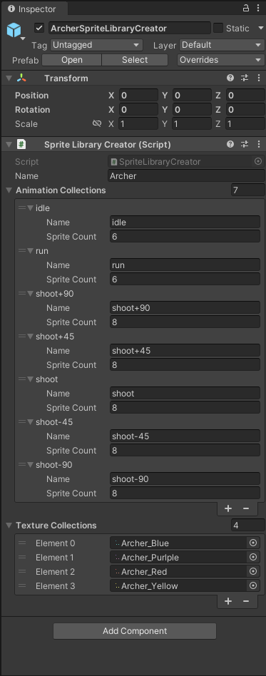

# Helper4Unity2D
A set of classes to help with boring task

# Final Result

Create Sprite Library Assets easier

# How it Works

## Prepare your sliced sprites
First, slice your spritesheet as you usually do, multiple, open Sprite Editor and cut them by its dimensions.

The image below, shows an image with 7 actions. One row each.

Also, I have the very same configuration for another image, different 'skin'

After sliced, looks like that

## Create a new GameObject in the scene
For this, I renamed according to the many 'characters' I have to import

## Final step (to use, righ click the script in GameObject)
Add the new script (SpriteLibraryCreator) to that very same GameObject. 
- Name the library you are creating...
- Add many animations as it is required (my case, 7)
- Name all the animations
- Provide the sprite count it is required for that single animation

- Right click, script to execute the creator
